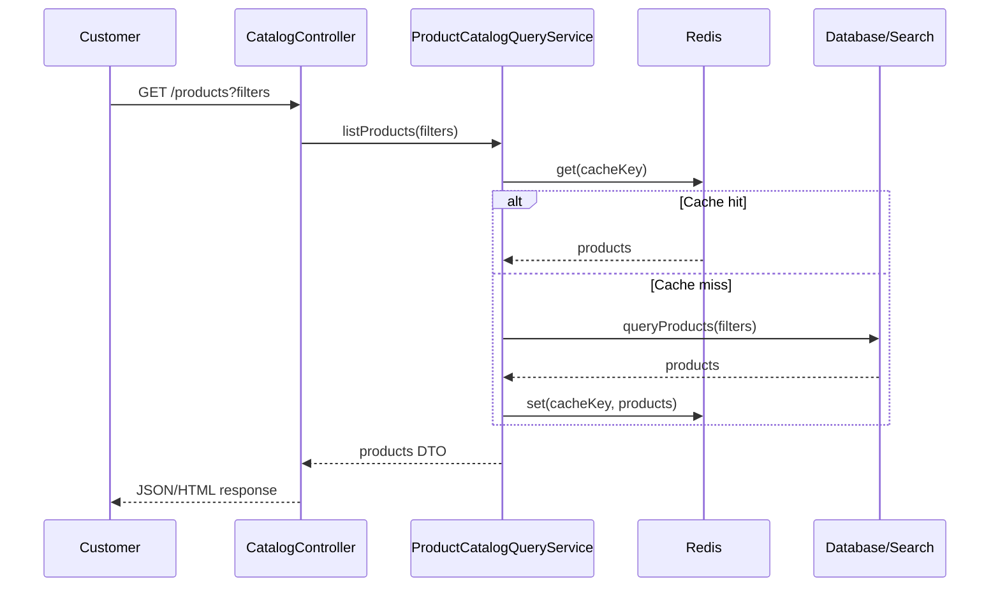
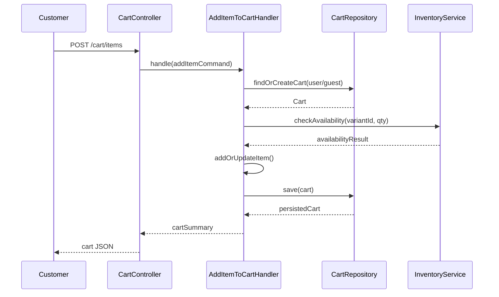
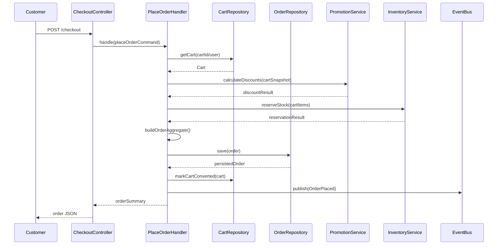
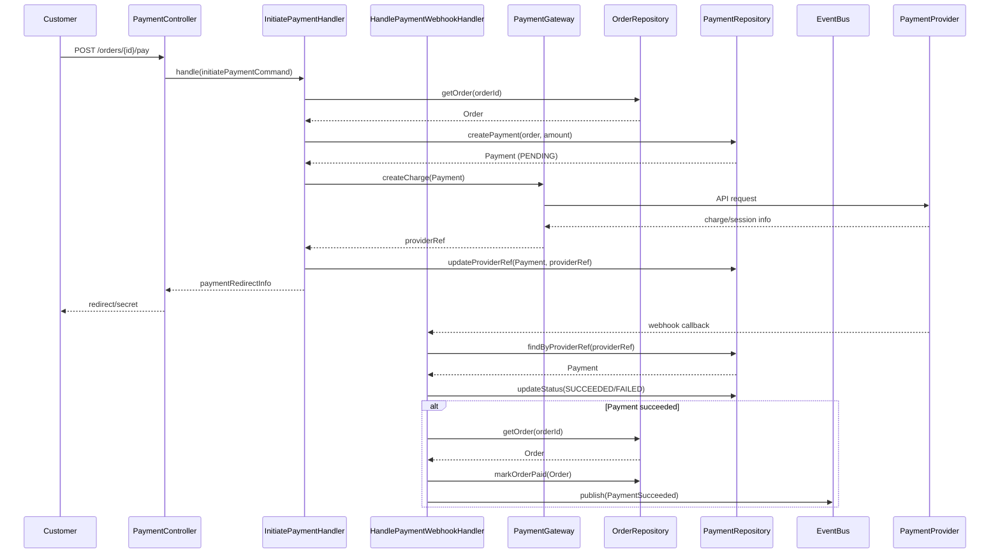
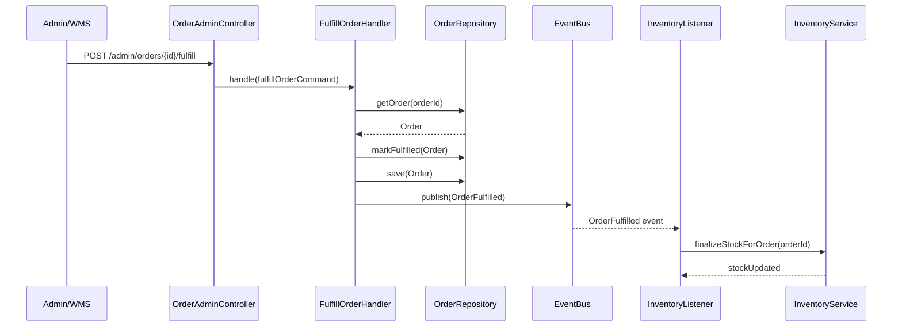
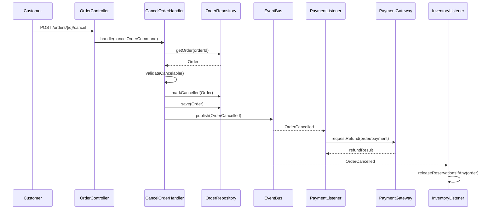

## Ecommerce System – Core Flows & Sequence Diagrams

This document describes the main business flows and their high‑level sequence diagrams (text/mermaid style) for the ecommerce system.

### 1. Browse Products & View Product Details

**Goal**: Customer views product lists and details with fast, cached responses.

**High‑Level Sequence**

1. Customer → `GET /products` with filters.
2. `CatalogController` validates and forwards to `ProductCatalogQueryService`.
3. `ProductCatalogQueryService`:
   - Checks Redis for cached result.
   - On miss, queries DB or Search Engine, builds DTOs, stores in cache.
4. Result returned to customer.

### 2. Add Item to Cart

**Goal**: Safely add a product variant to cart, checking basic availability.

**High‑Level Sequence**

1. Customer → `POST /cart/items`.
2. `CartController` validates and calls `AddItemToCartHandler`.
3. `AddItemToCartHandler`:
   - Loads or creates `Cart` aggregate via `CartRepository`.
   - Optionally calls Inventory (`InventoryService`) for availability.
   - Adds/updates `CartItem` in the Cart domain object.
   - Persists updated cart.
4. Returns updated cart summary.

### 3. Checkout & Place Order

**Goal**: Turn a cart into a confirmed order with a consistent snapshot of prices, taxes, and addresses.

**High‑Level Sequence**

1. Customer → `POST /checkout`.
2. `CheckoutController` validates data and calls `PlaceOrderHandler`.
3. `PlaceOrderHandler`:
   - Loads cart via `CartRepository`.
   - Calls Catalog/Promotion services to recalculate prices and discounts.
   - Calls `InventoryService` to reserve stock atomically for each item.
   - Creates `Order` aggregate with all snapshots (items, totals, addresses).
   - Persists via `OrderRepository`.
   - Marks cart as converted/closed.
   - Emits `OrderPlaced` domain event.
4. Response includes order summary and payment initiation details.

### 4. Online Payment Flow

**Goal**: Process online payment via external provider, ensuring order/payment consistency.

**High‑Level Sequence**

1. Customer → `POST /orders/{id}/pay`.
2. `PaymentController` calls `InitiatePaymentHandler`.
3. `InitiatePaymentHandler`:
   - Verifies order status allows payment.
   - Creates `Payment` record (status `PENDING`).
   - Calls `PaymentGateway` adapter to create charge/session.
   - Stores provider reference/secret.
4. Customer is redirected to payment provider or uses client secret.
5. Payment provider sends webhook → `PaymentWebhookController`.
6. `PaymentWebhookController` calls `HandlePaymentWebhookHandler`.
7. `HandlePaymentWebhookHandler`:
   - Finds `Payment` by provider reference.
   - Updates `Payment` status.
   - If succeeded:
     - Updates `Order` status to `PAID`.
     - Emits `PaymentSucceeded` event.

### 5. Inventory Update & Fulfillment

**Goal**: Ensure stock levels reflect final fulfillment state and reservations are cleaned up.

**High‑Level Sequence**

1. Warehouse/admin marks order as shipped/fulfilled (`OrderFulfilled` use case).
2. `FulfillOrderHandler`:
   - Validates current order status.
   - Updates order status to `FULFILLED`.
   - Emits `OrderFulfilled` event.
3. Inventory listener (`OnOrderFulfilled`) reacts:
   - Converts reservations into final stock deductions (if not already done).
   - Records `StockMovement` entries.
4. Notifications listener sends shipment confirmation.

### 6. Abandoned Cart & Expired Reservations

**Goal**: Clean up stale carts and free reserved stock.

**High‑Level Sequence**

1. Scheduler triggers periodic job (e.g. every 5–15 minutes).
2. Job queries for carts/reservations past their expiration time.
3. For each expired reservation:
   - Releases stock back to available quantity.
   - Marks reservation as expired.
4. For abandoned carts (no activity for threshold):
   - Mark as `abandoned`.
   - Optionally emit event for marketing automation.

These flows ensure that stock is not permanently locked by stale sessions and that the inventory view remains accurate.

### 7. Order Cancellation & Refunds

**Goal**: Allow customers or admins to cancel orders under defined conditions and process refunds through payment providers.

**High‑Level Sequence (Customer‑initiated cancellation before shipment)**

1. Customer → `POST /orders/{id}/cancel`.
2. `OrderController@cancel` calls `CancelOrderHandler`.
3. `CancelOrderHandler`:
   - Loads order and validates state (e.g. not yet fulfilled; rules per payment status).
   - Updates order status to `CANCELLED`.
   - Emits `OrderCancelled` event.
4. Listener in Payment module checks if payment was captured:
   - If captured:
     - Creates refund request via `PaymentGateway`.
     - Updates `Refund` record and emits `RefundProcessed` on success.
5. Inventory listener reacts to `OrderCancelled`:
   - Releases reserved stock if not yet released/finalized.

### 8. Guest Checkout & Account Creation

**Goal**: Support checkout without prior registration, while still allowing users to create an account later and attach orders.

**High‑Level Sequence**

1. Guest browses and adds items to cart using guest token.
2. At checkout, guest fills in email and address details.
3. `CheckoutController` calls `PlaceOrderHandler` with guest customer data.
4. `PlaceOrderHandler`:
   - Creates order with `user_id = null`, stores email and addresses in snapshots.
5. Optional flow: guest later creates an account with the same email.
6. A background job or explicit use case links historical guest orders to the new user account.

This flow avoids forcing registration while keeping data linkable when desired.

