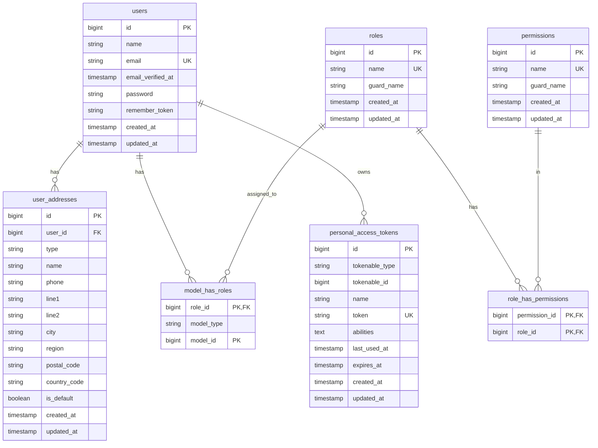

# Ecommerce System – Database Diagrams

This document contains database entity-relationship diagrams (ERD) for the ecommerce system at different stages of development.

---

## Current State: Phase 1 (User & Identity)

### Database Schema - Phase 1

### Current Tables Summary

- **users** - Core user accounts
- **user_addresses** - Billing/shipping addresses
- **roles** - User roles (customer, support, admin, super_admin)
- **permissions** - Granular permissions
- **model_has_roles** - User-role assignments (Spatie Permission)
- **role_has_permissions** - Role-permission assignments (Spatie Permission)
- **personal_access_tokens** - Sanctum API tokens

---

## Final State: Complete Ecommerce System

### Full Database Schema - All Phases

```mermaid
erDiagram
    %% User & Identity Module
    users ||--o{ user_addresses : "has"
    users ||--o{ model_has_roles : "has"
    roles ||--o{ model_has_roles : "assigned_to"
    roles ||--o{ role_has_permissions : "has"
    permissions ||--o{ role_has_permissions : "in"
    users ||--o{ personal_access_tokens : "owns"
    users ||--o{ carts : "owns"
    users ||--o{ orders : "places"
    users ||--o{ coupon_redemptions : "uses"
    users ||--o{ wishlists : "has"
    users ||--o{ product_reviews : "writes"

    %% Catalog Module
    brands ||--o{ products : "has"
    products ||--o{ category_product : "belongs_to"
    categories ||--o{ category_product : "has"
    categories ||--o{ categories : "parent"
    products ||--o{ product_variants : "has"
    product_variants ||--o{ product_prices : "has"
    products ||--o{ wishlist_items : "in"
    wishlists ||--o{ wishlist_items : "contains"
    products ||--o{ product_reviews : "has"

    %% Inventory Module
    warehouses ||--o{ stock_items : "has"
    product_variants ||--o{ stock_items : "tracked_in"
    product_variants ||--o{ stock_reservations : "reserved"
    warehouses ||--o{ stock_reservations : "from"
    product_variants ||--o{ stock_movements : "moved"
    warehouses ||--o{ stock_movements : "at"

    %% Cart Module
    carts ||--o{ cart_items : "contains"
    product_variants ||--o{ cart_items : "added_as"
    carts ||--o{ cart_coupons : "has"
    coupons ||--o{ cart_coupons : "applied_to"

    %% Order Module
    orders ||--o{ order_lines : "contains"
    product_variants ||--o{ order_lines : "ordered_as"
    orders ||--o{ order_status_history : "tracks"
    orders ||--o{ payments : "paid_by"
    orders ||--o{ shipments : "shipped_as"

    %% Payment Module
    payments ||--o{ refunds : "refunded_by"

    %% Promotion Module
    promotions ||--o{ coupons : "defines"
    coupons ||--o{ coupon_redemptions : "redeemed"
    orders ||--o{ coupon_redemptions : "uses"

    %% Shipping Module
    shipping_methods ||--o{ shipping_method_zones : "available_in"
    orders ||--o{ shipments : "fulfilled_as"

    %% Core Tables
    users {
        bigint id PK
        string name
        string email UK
        timestamp email_verified_at
        string password
        string remember_token
        timestamp created_at
        timestamp updated_at
    }

    user_addresses {
        bigint id PK
        bigint user_id FK
        string type
        string name
        string phone
        string line1
        string line2
        string city
        string region
        string postal_code
        string country_code
        boolean is_default
        timestamp created_at
        timestamp updated_at
    }

    brands {
        bigint id PK
        string name
        string slug UK
        timestamp created_at
        timestamp updated_at
    }

    categories {
        bigint id PK
        bigint parent_id FK
        string name
        string slug UK
        integer position
        timestamp created_at
        timestamp updated_at
    }

    category_product {
        bigint product_id PK,FK
        bigint category_id PK,FK
    }

    products {
        bigint id PK
        string slug UK
        string name
        text description
        bigint brand_id FK
        string status
        string main_image_url
        string seo_title
        text seo_description
        timestamp created_at
        timestamp updated_at
        timestamp deleted_at
    }

    product_variants {
        bigint id PK
        bigint product_id FK
        string sku UK
        string name
        json attributes
        boolean is_default
        timestamp created_at
        timestamp updated_at
    }

    product_prices {
        bigint id PK
        bigint product_variant_id FK
        string currency
        decimal amount
        decimal compare_at_amount
        string channel
        date valid_from
        date valid_to
        timestamp created_at
        timestamp updated_at
    }

    warehouses {
        bigint id PK
        string name
        string code UK
        string country_code
        string region
        string city
        timestamp created_at
        timestamp updated_at
    }

    stock_items {
        bigint id PK
        bigint product_variant_id FK
        bigint warehouse_id FK
        integer quantity
        integer safety_stock
        timestamp created_at
        timestamp updated_at
    }

    stock_reservations {
        bigint id PK
        bigint product_variant_id FK
        bigint warehouse_id FK
        integer quantity
        string source_type
        bigint source_id
        timestamp expires_at
        string status
        timestamp created_at
        timestamp updated_at
    }

    stock_movements {
        bigint id PK
        bigint product_variant_id FK
        bigint warehouse_id FK
        string type
        integer quantity
        string reason_code
        string reference_type
        bigint reference_id
        timestamp created_at
    }

    carts {
        bigint id PK
        bigint user_id FK
        string guest_token UK
        string currency
        string status
        timestamp last_activity_at
        timestamp created_at
        timestamp updated_at
    }

    cart_items {
        bigint id PK
        bigint cart_id FK
        bigint product_variant_id FK
        integer quantity
        decimal unit_price_amount
        string unit_price_currency
        decimal discount_amount
        string discount_currency
        timestamp created_at
        timestamp updated_at
    }

    cart_coupons {
        bigint id PK
        bigint cart_id FK
        string coupon_code
        decimal discount_amount
        string discount_currency
        timestamp applied_at
    }

    orders {
        bigint id PK
        string order_number UK
        bigint user_id FK
        string status
        string currency
        decimal subtotal_amount
        decimal discount_amount
        decimal tax_amount
        decimal shipping_amount
        decimal total_amount
        json billing_address_json
        json shipping_address_json
        json items_snapshot_json
        string shipping_method_code
        string shipping_method_name
        json tax_breakdown_json
        timestamp created_at
        timestamp updated_at
    }

    order_lines {
        bigint id PK
        bigint order_id FK
        bigint product_variant_id FK
        string product_name_snapshot
        string sku_snapshot
        integer quantity
        decimal unit_price_amount
        string unit_price_currency
        decimal discount_amount
        string discount_currency
        decimal tax_amount
        decimal total_line_amount
        timestamp created_at
        timestamp updated_at
    }

    order_status_history {
        bigint id PK
        bigint order_id FK
        string from_status
        string to_status
        bigint changed_by_user_id FK
        string reason
        timestamp created_at
    }

    payments {
        bigint id PK
        bigint order_id FK
        string provider
        string provider_reference UK
        decimal amount
        string currency
        string status
        json raw_response_json
        timestamp created_at
        timestamp updated_at
    }

    refunds {
        bigint id PK
        bigint payment_id FK
        decimal amount
        string currency
        string status
        string reason
        json raw_response_json
        timestamp created_at
        timestamp updated_at
    }

    promotions {
        bigint id PK
        string name
        string type
        string rule_type
        decimal value
        timestamp starts_at
        timestamp ends_at
        integer priority
        boolean is_active
        json conditions_json
        timestamp created_at
        timestamp updated_at
    }

    coupons {
        bigint id PK
        string code UK
        bigint promotion_id FK
        integer usage_limit
        integer usage_limit_per_user
        timestamp starts_at
        timestamp ends_at
        boolean is_active
        timestamp created_at
        timestamp updated_at
    }

    coupon_redemptions {
        bigint id PK
        bigint coupon_id FK
        bigint user_id FK
        bigint order_id FK
        timestamp redeemed_at
    }

    shipping_methods {
        bigint id PK
        string code UK
        string name
        text description
        boolean is_active
        timestamp created_at
        timestamp updated_at
    }

    shipping_method_zones {
        bigint id PK
        bigint shipping_method_id FK
        string country_code
        string region
        string postal_code_pattern
        decimal min_cart_total
        decimal max_cart_total
        decimal base_amount
        decimal per_kg_amount
        string currency
        timestamp created_at
        timestamp updated_at
    }

    shipments {
        bigint id PK
        bigint order_id FK
        string tracking_number
        string carrier_code
        string status
        timestamp shipped_at
        timestamp delivered_at
        timestamp created_at
        timestamp updated_at
    }

    wishlists {
        bigint id PK
        bigint user_id FK
        timestamp created_at
        timestamp updated_at
    }

    wishlist_items {
        bigint id PK
        bigint wishlist_id FK
        bigint product_variant_id FK
        timestamp created_at
    }

    product_reviews {
        bigint id PK
        bigint user_id FK
        bigint product_id FK
        integer rating
        string title
        text body
        string status
        timestamp created_at
        timestamp updated_at
    }
```

---

## Key Relationships Summary

### User & Identity
- `users` → `user_addresses` (1:N)
- `users` → `carts` (1:N, optional for guests)
- `users` → `orders` (1:N, optional for guests)
- `users` → `wishlists` (1:1)
- `users` → `product_reviews` (1:N)

### Catalog
- `products` → `product_variants` (1:N)
- `product_variants` → `product_prices` (1:N, multi-currency)
- `products` ↔ `categories` (N:M via `category_product`)
- `categories` → `categories` (self-referential, parent-child)

### Inventory
- `product_variants` → `stock_items` (1:N, per warehouse)
- `product_variants` → `stock_reservations` (1:N)
- `product_variants` → `stock_movements` (1:N, audit trail)

### Cart
- `carts` → `cart_items` (1:N)
- `cart_items` → `product_variants` (N:1, with price snapshot)
- `carts` → `cart_coupons` (1:N)

### Order
- `orders` → `order_lines` (1:N, immutable snapshot)
- `order_lines` → `product_variants` (N:1, reference only)
- `orders` → `order_status_history` (1:N, audit trail)
- `orders` → `payments` (1:N)
- `orders` → `shipments` (1:N)

### Payment
- `payments` → `refunds` (1:N)

### Promotion
- `promotions` → `coupons` (1:N)
- `coupons` → `coupon_redemptions` (1:N)
- `orders` → `coupon_redemptions` (1:1)

### Shipping
- `shipping_methods` → `shipping_method_zones` (1:N)
- `orders` → `shipments` (1:N)

---

## Database Statistics (Final State)

- **Total Tables**: ~35+ tables
- **Core Modules**: 9 modules (User, Catalog, Inventory, Cart, Order, Payment, Promotion, Shipping, Notification)
- **Junction Tables**: 3 (`category_product`, `model_has_roles`, `role_has_permissions`)
- **Audit/History Tables**: 2 (`order_status_history`, `stock_movements`)
- **Soft Deletes**: `products` (and potentially others)

---

## Notes

- All foreign keys should have appropriate indexes for performance
- `orders` and `order_lines` store immutable snapshots (no direct FK to products after order is placed)
- `stock_reservations` uses polymorphic relationship (`source_type` + `source_id`) for cart/order references
- Multi-currency support via `product_prices` and currency fields in money-related tables
- Guest checkout supported via `user_id = null` in `orders` and `carts.guest_token`
